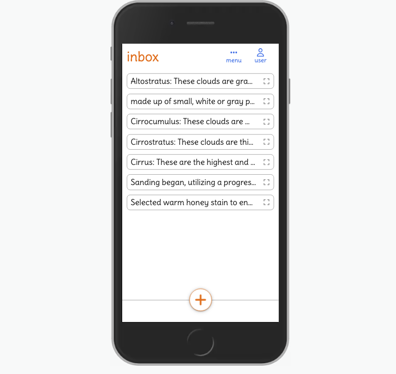
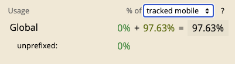
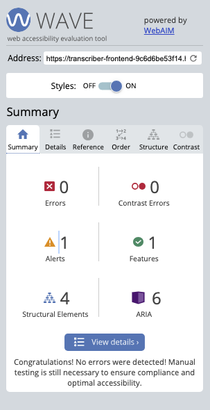

# Transcriber - frontend


View the live site [here](https://transcriber-frontend-9c6d6be53f14.herokuapp.com/).

View the backend REST API: [GitHub repo](https://github.com/timgoalen/transcriber-backend) - [deployed API](https://transcriber-backend-api-22aee3c5fb11.herokuapp.com/).


## About

**Transcriber** is a note-taking app designed with a focus on speech recognition. It features AI-powered auto-formatting, a folders page and a comprehensive search page.

**Fast Idea Capture**: Especially on mobile devices, where typing with thumbs can be slow, the voice recognition feature allows you to quickly capture your ideas as you speak, speeding up the process compared to manual typing.

**Streamline Difficult Writing**: Using voice dictation lets you express your thoughts at the natural pace of speech, helping you overcome writer's block and get that first draft out quickly.

### Project Goals

The goals for the site’s functionality were:

- Voice recognition: users can dictate text to the app.
- User authentication: users can create an account, log in and log out of the app.
- Notes: users can create, read, update and delete notes.
- Inbox: the app has an inbox where notes are stored by default.
- Folders: users can create, read, update and delete folders; and also move notes into folders.
- Search: users can search for notes and folders they have created.
- Auto-formatter: users can automatically correct spelling and punctuation when creating a note.
- Custom prompts: users can create their own prompts to auto-format their notes using AI.

<details>
    <summary>List of the project goals mapped to the user story Epics:</summary>
    <ul>
        <li>Voice recognition: users can dictate text to the app.
            <ul>
                <li><a href="https://github.com/timgoalen/transcriber-frontend/issues/32">EPIC: SPEECH RECOGNITION</a></li>
            </ul>
        </li>
        <li>User authentication: users can create an account, log in and log out of the app.
            <ul>
                <li><a href="https://github.com/timgoalen/transcriber-frontend/issues/30">EPIC: USER ACCOUNTS</a></li>
            </ul>
        </li>
        <li>Notes: users can create, read, update and delete notes.
            <ul>
                <li><a href="https://github.com/timgoalen/transcriber-frontend/issues/27">EPIC: NOTES CRUD</a></li>
            </ul>
        </li>
        <li>Inbox: the app has an inbox where notes are stored by default.
            <ul>
                <li><a href="https://github.com/timgoalen/transcriber-frontend/issues/27">EPIC: NOTES CRUD</a></li>
            </ul>
        </li>
        <li>Folders: users can create, read, update and delete folders; and also move notes into folders.
            <ul>
                <li><a href="https://github.com/timgoalen/transcriber-frontend/issues/28">EPIC: FOLDERS CRUD</a></li>
            </ul>
        </li>
        <li>Search: users can search for notes and folders they have created.
            <ul>
                <li><a href="https://github.com/timgoalen/transcriber-frontend/issues/34">EPIC: SEARCH</a></li>
            </ul>
        </li>
        <li>Auto-formatter: users can automatically correct spelling and punctuation when creating a note.
            <ul>
                <li><a href="https://github.com/timgoalen/transcriber-frontend/issues/33">EPIC: AI FORMATTING</a></li>
            </ul>
        </li>
        <li>Custom prompts: users can create their own prompts to auto-format their notes using AI.
            <ul>
                <li><a href="https://github.com/timgoalen/transcriber-frontend/issues/31">EPIC: PROMPTS CRUD</a></li>
            </ul>
        </li>
    </ul>
</details>

## Agile Development

A Kanban board in Github projects was used for the Agile development process - see the board [here](https://github.com/users/timgoalen/projects/4).

‘Epics’ were broken down into ‘User Stories’, which were further broken down into ‘Tasks’.

## User Experience & Design

### Wireframes

High-fidelity mockups were made in Figma, using a mobile-first approach, to test the design before building the site.

The general approach was to find the simplest and cleanest layout possible, to limit visual distraction and encourage focus.

**Home page:**


Changes to the mockup in the deployed app:

- Re-designing the header and navigation.
- Re-labelling the “delete” button as “clear”.
- Adding a magic wand button for AI auto-formatting.

**Inbox:**


Changes to the mockup in the deployed app:

- Naming the page “inbox” rather than “notes”.
- Changing the folder icon to make it clear that the items are clickable.

**Folders:**


**Note Detail Modal:**


Changes to the mockup in the deployed app:

- Adding the “folder” option to the tool bar.

**Log In:**


Changes to the mockup in the deployed app:

- Adding a navigation header.

**Sign Up:**


Changes to the mockup in the deployed app:

- Adding a navigation header.

### Colour Scheme


The site’s primary colours - orange and blue - were adjusted from the Figma mockups to achieve a better contrast ratio, using Contrast Ratio feature in the Chrome DevTools colour picker:


The colour scheme was chosen to be led by a simple white, with the bold orange and blue acting as accent colours.

### Typography


Delius was chosen for its relaxed and playful style, adding more character to the design than a standard sans serif font.

## Features

### Home page

Desktop:


Mobile:


### Voice Recognition & Audio Analyser


- The audio analyser was implemented to give users direct feedback that recording was taking place, along with the change in border colour of the text area and microphone button that shows recording status.
- Users can verbalise punctuation like “full stop”, “comma” and “exclamation mark”, or use the auto-formatter explained below.


- The auto-format button, powered by the OpenAi API, allows users to instantly correct spelling and punctuation on their written or dictated text.

### Custom AI Prompts


- Users can create and save their own prompts for formatting notes.
- Click-and-hold on the ‘AI’ button to open the dialogue.

### Navigation Menu


### User Menu

Logged out:


Logged in:


### Inbox

Mobile:



Desktop:


Empty inbox:


### Note Detail Modal

When users click on a note item, the note detail modal is opened:


The modal after the ‘Folder’ button is clicked:


### Folders

Mobile:


- The user can click on the folder to see its contained notes in the dropdown.
- The expand icon in the note item takes on the colour of the parent folder.

Desktop:


Empty folders page:


### Edit


### Search


- Because all the notes and folder are stored in state, the search filtering is instantaneous, compared to the approach of sending API queries.

### Notifications


- All user actions are confirmed in the notifications on the bottom left of the screen.

### Sign Up


### Log In


### Info Box


### 404 Error Page


## Features to Implement in the Future

- Upgrade to a paid, and potentially more reliable voice recognition service (like OpenAI ‘Whisper’ or Google ‘speech-to-text’).
- Add drag and drop functionality to move notes to different folders.
- Implement React Query or SWR to manage API caching.
- Consider using Redux or Zustand to manage global state.
- Add rich text or markdown formatting capability, or perhaps Notion-style, as a series of `contenteditable` HTML blocks.
- Allow users to register with email instead of username.
- Implement email password reset.
- Implement social signup.
- Make the OpenAiApi component only available to logged in users, to save on use fees (but good for showreel purposes to let users demo it).
- Add ‘offline’ warning in header when no internet connection.
- Enable the voice recognition to append text to where the cursor is (instead of only to the end of the note).
- Consider changing the custom prompt feature to a list of baked-in prompts, to minimise unpredictable responses from the AI.

## React Components

One of the main benefits of using React for this project is the ability to re-use components. Here are examples of the components that were re-used the most:

- NavItem.js
- NoteListItem.js
- FolderListItem.js
- FolderOptionItem.js
- NoteDetailModal.js
- LoadingSpinner.js
- NewFolderForm.js
- NotesInfFolderDropdown.js
- CloseBtn.js

<details>
  <summary>Complete list of pages and components linked to their relevant User Stories.</summary>
  <ul>
    <li>Pages
      <ul>
        <li>Edit
          <ul>
            <li>USER STORY: Speech recognition #39</li>
            <li>USER STORY: Audio visualizer #38</li>
            <li>USER STORY: Edit notes #11</li>
          </ul>
        </li>
        <li>Folders
          <ul>
            <li>USER STORY: Read notes #29</li>
            <li>USER STORY: Delete a folder #18</li>
            <li>USER STORY: View folders #17</li>
            <li>USER STORY: Edit folder title #15</li>
            <li>USER STORY: Create a folder #14</li>
            <li>USER STORY: Delete a note #13</li>
          </ul>
        </li>
        <li>Home
          <ul>
            <li>USER STORY: Speech recognition #39</li>
            <li>USER STORY: Audio visualizer #38</li>
            <li>USER STORY: Create a note #10</li>
          </ul>
        </li>
        <li>Inbox
          <ul>
            <li>USER STORY: Read notes #29</li>
            <li>USER STORY: Delete a note #13</li>
          </ul>
        </li>
        <li>LogIn
          <ul>
            <li>NoPage</li>
          </ul>
        </li>
        <li>Search
          <ul>
            <li>USER STORY: Search #26</li>
          </ul>
        </li>
        <li>SignUp
          <ul>
            <li>NoPage</li>
          </ul>
        </li>
      </ul>
    </li>
    <li>Components
      <ul>
        <li>AccountNav
          <ul>
            <li>USER STORY: Sign up & log in #19</li>
          </ul>
        </li>
        <li>Header</li>
        <li>MenuNav</li>
        <li>NavItem</li>
        <li>PageMenu</li>
        <li>AddAuxItemBtn</li>
        <li>AudioVisualizer
          <ul>
            <li>USER STORY: Audio visualizer #38</li>
          </ul>
        </li>
        <li>Button</li>
        <li>CloseBtn</li>
        <li>CustomPrompts
          <ul>
            <li>USER STORY: Read custom prompts #25</li>
            <li>USER STORY: Update prompt #40</li>
            <li>USER STORY: Delete custom prompt #24</li>
          </ul>
        </li>
        <li>SearchBar
          <ul>
            <li>USER STORY: Search #26</li>
          </ul>
        </li>
        <li>SignUpForm
          <ul>
            <li>USER STORY: Sign up & log in #19</li>
          </ul>
        </li>
        <li>SpeechRecognition
          <ul>
            <li>USER STORY: Speech recognition #39</li>
            <li>USER STORY: Voice punctuation #21</li>
          </ul>
        </li>
        <li>TextArea</li>
        <li>Toolbar</li>
        <li>Transcriber
          <ul>
            <li>USER STORY: Create a note #10</li>
            <li>USER STORY: Speech recognition #39</li>
            <li>USER STORY: Audio visualizer #38</li>
          </ul>
        </li>
        <li>UserMessages</li>
      </ul>
    </li>
  </ul>
</details>

## SpeechRecognition

The speech recognition technology being used is part of the built-in browser Web Speech API. The browser support isn’t 100% yet, and it won’t work on Firefox and older browsers. As a future feature, migrating to a speech recognition service like OpenAi’s Whisper would improve compatibility.

Here is the current stats on browser support for the SpeechRecognitionEvent API:

All users:


Mobile:



Desktop:


## Architecture

### State Architecture: **Centralised vs Distributed API Calls**

I decided to make all the API data fetching (of the ‘notes’ and ‘folders’ arrays) happen within the App itself, and to pass down the data as props, to the Inbox, Folders and Search components.

As the application won’t be dealing with large amounts of data, the simpler Centralised approach was preferred, in spite of it meaning there would be some unneeded data sent to the Inbox and Folders pages.

Diagrams of both approaches:

**Centralised API Calls**


Make the call once in the App and pass the retrieved data down as props.

- Pros:
  - Keep state consistent throughout the app, as a ‘single source of truth’.
  - Less code duplication.
  - Improved performance when navigating through pages where the data is unchanged.
- Cons**:**
  - Redundant data if some pages require filtered data.
  - It could harm performance if the data set is large.

**Distributed API Calls**


Each page makes its own API call, of just the specific data that it needs.

- Pros**:**
  - Potentially better performance is the data is different across the pages.
  - More scalable to complex applications.
- Cons**:**
  - Higher risk of state inconsistency.
  - More code duplication in the API calls.

## User Messages

The main user notification system is implemented globally, with `UserMessagesContext`. Each component can dispatch a message to the context via the `addToMessages` function.

In two components - Inbox.js and Folders.js - I had to design a workaround, where messages needed to be sent through page redirects. The first approach was to pick up the messages using a useEffect that only runs on page load. But that led to ESLint warning about missing dependencies, which if fixed would lead to infinite loop re-rendering. The fix was to implement a component-scoped state that stored the messages, using the custom hook `usePrevLocationNotification` . In the future, all components could use the locally-scoped messages system to avoid two different approaches being used in the app.

## CRUD Capabilities

A list of CRUD actions and the components from which they’re dispatched:

### Notes

- CREATE
  - `<Transcriber />`
- READ
  - `<App />`
- UPDATE
  - Update the note text - `<Transcriber />`
- UPDATE
  - Move the note to a folder - `<FolderOptionItem />`
- DELETE
  - `<NoteDetailModal />`

### Folders

- CREATE
  - `<App />`
  - Note: the create function is in the App so that it can be shared with the Inbox and Folder pages, to be used within the `<NoteDetailModal />` component.
- READ
  - `<App />`
- UPDATE
  - `<Folders />`
- DELETE
  - `<FolderListItem />`

### Prompts

- CREATE
  - `<CustomPrompts />`
- READ
  - `<CustomPrompts />`
- UPDATE
  - `<CustomPrompts />`
- DELETE
  - `<PromptListItem />`

## Technologies Used

- Framework/Library:
  - React
- Languages:
  - JavaScript
  - JSX
  - CSS
- [Create React App](https://create-react-app.dev/) - to set up the React project.
- [Visual Studio Code](https://code.visualstudio.com/) - as the code editor.
- [Git](https://git-scm.com/) - for version control, using the Gitpod IDE.
- [GitHub](https://github.com/) - for storing the project.
- [ElephantSQL](https://www.elephantsql.com/) - PostgreSQL as a service.
- [Heroku](https://www.heroku.com/) - to deploy the application.
- [Chrome Developer Tools](https://developer.chrome.com/docs/devtools/) - to test responsiveness, edit CSS code, debug JavaScript and generate Lighthouse reports.
- [Google Fonts](https://fonts.google.com/) - to import the site font, ‘Delius’.
- [Figma](http://figma.com) - to create the wireframes.
- [Font Awesome](https://fontawesome.com/) - for all the site icons.
- [Gauger Fonticon](https://gauger.io/fonticon/) - for the favicon.
- [Coolers](https://coolers.co/) - for an overview of the chosen colour palette.
- [Am I Responsive](https://ui.dev/amiresponsive) - to create the responsive demo image at the top of the Readme.
- [Excalidraw](https://excalidraw.com/) - to create the state architecture diagrams.
- [Quicktime](https://support.apple.com/en-gb/guide/quicktime-player/welcome/mac) - to record the screen capture for GIFs in the readme.
- [Ezgif](https://ezgif.com/) - to convert the Readme GIFs.
- [WebAIM WAVE](https://wave.webaim.org/) - for automated testing of accessibility.
- [WebAIM Contrast Checker](https://webaim.org/resources/contrastchecker/) - to check colour contrast accessibility.
- [Eightshapes Contrast Grid](https://contrast-grid.eightshapes.com/) - to visualise the contrast accessibility of the whole site colour palette.
- [ESLint](https://eslint.org/) - to test the JavaScript code.
- [W3C CSS Validator](https://jigsaw.w3.org/css-validator) - to test the CSS code.

### Third-party APIs Used

- [OpenAI API](https://openai.com/blog/openai-api) - used as a text formatter and spelling corrector.

### React Libraries Used

- [react-router-dom](https://reactrouter.com/en/main) - for page routing and sending data between pages. Improves site responsiveness and User Experience compared to traditional HTML pages.
- [axios](https://axios-http.com/) - for simplified syntax with the HTTP requests to the API.
- [dotenv](https://www.npmjs.com/package/react-dotenv) - to enable the use of .env files to store the OpenAI API key.
- [font-awesome](https://fontawesome.com/v5/docs/web/use-with/react) - for the site icons.
- [framer-motion](https://www.framer.com/motion/) - enabling the use of animated transitions within React.
- [use-long-press](https://minwork.gitbook.io/long-press-hook/) - simplifies the syntax for the press-and-hold button to open the custom prompts dialogue.

## Testing

### Automated Testing

**ESLint**

All JavaScript files were tested with ESLint, with all errors fixed apart from one ‘missing dependencies’ error in the component Transcriber.js (line 69), where I left the code as it is and added `eslint-disable-next-line`. The useEffect in this case handles data passed from other pages and therefore will never change when the component re-renders. Adding the dependency array led to a rendering loop.

**CSS Validation**

All CSS modules and index.css were validated by [W3C CSS Validator](https://jigsaw.w3.org/css-validator), with no errors present.

**Lighthouse Testing**

All pages were tested with Google Chrome’s Lighthouse.

Home (desktop):


Home (mobile):


Inbox (desktop):


Inbox (mobile):


Folders (desktop):


Folders(mobile):


Edit (desktop):


Edit (mobile):


Search (desktop):


Search (mobile):


Sign Up (desktop):


Sign Up (mobile):


Log In (desktop):


Log In (mobile):


404 (desktop):


404 (mobile):


Based on the recommendations from the initial round of Lighthouse testing, the following changes were made:

- Update colours for greater contrast.
- Add aria-labels to buttons that don’t have labels.
- Add aria-label to form input.
- Add meta description in head.

**WebAIM WAVE Accessibility Testing**

All pages were tested with the [WAVE tool](https://wave.webaim.org/).

The single alert refers to the Create-React-App boilerplate code that includes a <noscript> tag, and was left unchanged.




### User Stories Testing

All user stories were tested to confirm that they meet their Acceptance Criteria. The following have all PASSED.

(View the EPICS, User Stories, Acceptance Criteria and Tasks on the GitHub [Kanban Board](https://github.com/users/timgoalen/projects/4)).

---

EPIC: USER ACCOUNTS

---

As a **user** I can **create an account and log in** so that **I can use the application**.

- Acceptance Criteria - PASSED:
  - Sign up form
  - Log in form
  - User can create an account with a username and password
  - User can log in with that information and stay logged in until they log out on the device

---

As a **user** I can **log out of my account** so that **application data isn't visible to others on my computer**.

- Acceptance Criteria - PASSED:
  - User can log out of the application
  - The browser-stored user token is deleted
  - Log out confirmation message displayed
  - Notes, folder and prompts are cleared form state

---

EPIC: NOTES CRUD

---

As a **user** I can **create a note using my voice or by typing** so that I can **capture my thoughts quickly and efficiently**.

- Acceptance Criteria - PASSED:
  - User can write in a text form
  - User can dictate into the form
  - User receives visual feedback when the voice recognition component if listening.
  - Save button to save the form content

---

As a **user** I can **view a list of my notes** so that **I can save thoughts and information**.

- Acceptance Criteria - PASSED:
  - User can view a list of their notes
  - Default notes list is inbox

---

As a **user** I can **edit my notes** so that **I can work on my notes on multiple occasions**.

- Acceptance Criteria - PASSED:
  - User can update the text of a note
  - User is taken back to the voice recognition page

---

As a **user** I can **move my note to a folder** so that **I can organise my notes**.

- Acceptance Criteria - PASSED:
  - User can move a note from the inbox to a folder

---

As a **user** I can **delete my notes** so that **I can keep my inbox and folder clear of unneeded items**.

- Acceptance Criteria - PASSED:
  - User can delete a note

---

EPIC: FOLDERS CRUD

---

As a **user** I can **create folders** so that **my notes can be organised**.

- Acceptance Criteria - PASSED:
  - User can save folders

---

As a **user** I can **view a list of my folders** so that **I can see the notes inside of them**.

- Acceptance Criteria - PASSED:
  - Display list of a user's folders
  - User can click on the folder to view the contained notes

---

As a **user** I can **edit the title of my folders** so that **I can clarify my intentions**.

- Acceptance Criteria - PASSED:
  - User can edit a folder's title

---

As a **user** I can **delete folders** so that **I can remove unneeded folders and notes from my workspace**.

- Acceptance Criteria - PASSED:
  - User can delete folders
  - Delete contained notes when folder is deleted (after "delete notes in side folder" warning message)

---

EPIC: PROMPTS CRUD

---

As a **user** I can **create an custom prompt for the AI model** so that **I can have assistance with my note editing**.

- Acceptance Criteria - PASSED:
  - User can create and save a prompt with a form

---

As a **user** I can **view a list of my custom prompts** so that **I can select one to use**.

- Acceptance Criteria - PASSED:
  - User can view a list of their previously saved prompts

---

As a **user** I can **update my prompt** so that **I can correct typos or adjust my intention**.

- Acceptance Criteria - PASSED:
  - User can update prompt

---

As a **user** I can **delete my custom prompts** so that **I can keep the interface clear of unneeded information**.

- Acceptance Criteria - PASSED:
  - User can delete a custom prompt

---

EPIC: SPEECH RECOGNITION

---

As a **user** I can **dictate notes with my voice** so that **I can get my thoughts down quickly**.

- Acceptance Criteria - PASSED:
  - Users can dictate into the main text area in the home page
  - Users can dictate into the main text area in the edit page
  - Prominent microphone icon

---

As a **user** I can **view visual feedback when I'm dictating a note** so that **I can tell that the application is working**.

- Acceptance Criteria - PASSED:
  - Display audio visualizer when user clicks record
  - Hide visualizer when user stops recording

---

As a **use** I can **add punctuation to a note by using my voice** so that **I can work quickly**.

- Acceptance Criteria - PASSED:
  - Users can dictate: full stop, comma, question mark, exclamation mark, colon, new line, new paragraph and hyphen

---

EPIC: AI FORMATTING

---

As a **user** I can **quickly format my notes or correct the punctuation and spelling** so that **I can work quickly**.

- Acceptance Criteria - PASSED:
  - 'AI button' that auto-formats the text area, correcting spelling and punctuation
  - The ability to undo formatting

---

EPIC: SEARCH

---

As a **user** I can **search for my notes and folders** so that **I can quickly and easily find them**.

- Acceptance Criteria - PASSED:
  - Search input form
  - Search results display notes and folders, with headings
  - Results dynamically filter as the user types
  - User can click on notes and have CRUD capability

---

### Manual Testing

The following devices and browsers were used for manual & responsive UI testing.

- iPhone SE (2020)
  - Safari (v16)
  - Chrome (v114)
- iPad (6th Generation)
  - Chrome (v111)
  - Safari (v15)
- Mac Pro (Mid 2012)
  - Chrome (v116)
  - Firefox (v115)
- Dell Chromebook 3120
  - Chrome (v103)

## Bugs

### Fixed Bugs

| Bug | Fix |
| --- | --- |
| New paragraphs don’t show correctly on the note detail view. | CSS: Add `white-space: pre-line` to the containing `<div>`. |

### Unfixed Bugs

| Bug |
| --- |
| There are sometimes unpredictable results from the OpenAI API response, especially with long text. |
| Voice recognition can give inconsistent results, especially with “new line” and “new paragraph” voice commands, that sometimes insert a leading whitespace on the following word. |
| The click-and-hold functionality for opening the custom prompts box doesn’t work reliably in Chrome DevTools. |
| The audio visualiser is only half-width on mobile (but fine in the DevTools mobile view). |
| The browser still displays a media stream red light in the tab when the audio analyser unmounts, in the local dev server (it’s fine in the deployed version) |
| Speech recognition doesn’t capitalise the next character after voice added punctuation (”full stop”, “comma” etc.) when continuously recording, only when the recording has been started and stopped again. |

## Deployment

### Forking the GitHub Repository

By forking the GitHub Repository we make a copy of the original repository on our GitHub account to view and/or make changes without affecting the original repository by using the following steps...

1. Log in to GitHub and locate the [GitHub Repository](https://github.com/timgoalen/command-line-coffee)
2. At the top right of the Repository, just below the GitHub navbar, click on the "Fork" Button.
3. You should now have a copy of the original repository in your GitHub account.

### Making a Local Clone

1. Log in to GitHub and locate the [GitHub Repository](https://github.com/timgoalen/command-line-coffee)
2. Above the list of files, click "Code".
3. To clone the repository using HTTPS, under "Clone with HTTPS", copy the link.
4. Open Git Bash
5. Change the current working directory to the location where you want the cloned directory to be made.
6. Type `git clone`, and then paste the URL you copied in Step 3.

```
$ git clone https://github.com/YOUR-USERNAME/YOUR-REPOSITORY

```

1. Press Enter. Your local clone will be created.

```
$ git clone https://github.com/YOUR-USERNAME/YOUR-REPOSITORY
> Cloning into `CI-Clone`...
> remote: Counting objects: 10, done.
> remote: Compressing objects: 100% (8/8), done.
> remove: Total 10 (delta 1), reused 10 (delta 1)
> Unpacking objects: 100% (10/10), done.

```

Click [Here](https://help.github.com/en/github/creating-cloning-and-archiving-repositories/cloning-a-repository#cloning-a-repository-to-github-desktop) to retrieve pictures for some of the buttons and more detailed explanations of the above process.

1. For changes you've made to reflect on the live site\*:
   - Type `git add <files changed>`
   - Type `git commit -m <description of change>`
   - Type `git push`
   - In Heroku, after pushing to Github - if 'automatic deploys' aren't enabled, manually deploy by clicking 'Deploy Branch' in the Manual Deploy section.

### Set up the OpenAI API

1. Follow the steps outlined in the OpenAI [documentation](https://platform.openai.com/docs/introduction), to obtain an API key.
2. Set a spending limit in the [usage page](https://platform.openai.com/usage) [login required] if desired.
3. Create a .env file in your local repo and enter:

```jsx
REACT_APP_OPENAI_API_KEY = "<your-api-key>”
```

### Deploy to Heroku

1. Create a [Heroku](https://www.heroku.com/) account.
2. In the dashboard, click on ‘Create new app’ from the ‘New’ dropdown menu in the top right.
3. Name the app and choose a region.
4. In the ‘Settings’ tab, click on 'Reveal Config Vars’.
5. Enter you OpenAi API details:
   - KEY = REACT_APP_OPENAI_API_KEY
   - VALUE = `<your-api-key>`
6. In the 'Buildpacks' section click 'Add buildpack'.
7. Select ‘nodejs’, and click 'save changes'.
8. In the 'Deploy' tab, select GitHub as the deployment method, and click 'Connect to GitHub'.
9. In the 'App Connected to GitHub' section, search for the GitHub repository name, select it then click 'connect'.
10. Finally, either click ‘Enable Automatic Deploys’, or ‘Deploy Branch’ in the ‘Manual deploy’ section.

## Credits

### Content

The SVG used for the empty page placeholder is from:

https://freesvgillustration.com/product/banana-tree/

With customised colours chosen from the site palette, and passed as props to the component.

### Code

The following docs and tutorials were consulted.

**React**

[Official react docs](https://react.dev/learn)

[Colt Steele Udemy course](https://www.udemy.com/course/the-web-developer-bootcamp)

Guide to React Refs - [Logrocket](https://blog.logrocket.com/complete-guide-react-refs/)

React notes app with local storage tutorial - [Logrocket](https://blog.logrocket.com/notes-app-react-localstorage/)

React todo list tutorial - [MDN Web Docs](https://developer.mozilla.org/en-US/docs/Learn/Tools_and_testing/Client-side_JavaScript_frameworks/React_getting_started)

How to use an ‘env’ file in React - [Medium](https://medium.com/how-to-react/using-env-file-in-react-js-b2714235e77e)

Using font awesome in React - [dev.to](https://dev.to/davidemaye/how-to-set-up-font-awesome-in-react-5a8d)

**Speech Recognition API**

API Docs - [Chrome for developers](https://developer.chrome.com/blog/voice-driven-web-apps-introduction-to-the-web-speech-api/)

API Guide - [MDN](https://developer.mozilla.org/en-US/docs/Web/API/SpeechRecognition)

Speech recognition tutorial - [freeCodeCamp](https://www.freecodecamp.org/news/how-to-build-a-simple-speech-recognition-app-a65860da6108/)

Speech recognition tutorial - [tutorialzine.com](https://tutorialzine.com/2017/08/converting-from-speech-to-text-with-javascript)

**Audio Visualiser**

Audio visualiser tutorial - [Logrocket](https://blog.logrocket.com/audio-visualizer-from-scratch-javascript/?ssp=1&darkschemeovr=1&setlang=en-GB&safesearch=moderate)

Audio visualiser tutorial - [Wes Bos](https://wesbos.com/javascript/15-final-round-of-exercise/85-audio-visualization)

**OpenAI API**

[Official OpenAI docs](https://platform.openai.com/docs/quickstart?context=node)

Testing the API with Postman - [sap.com](https://blogs.sap.com/2023/08/31/test-openai-api-via-postman/)

Using OpenAI with React - [Medium](https://javascriptcentric.medium.com/how-to-use-openai-with-react-212d7d632854)

### Acknowledgements

- My mentor Lauren-Nicole Popich for her invaluable guidance.
